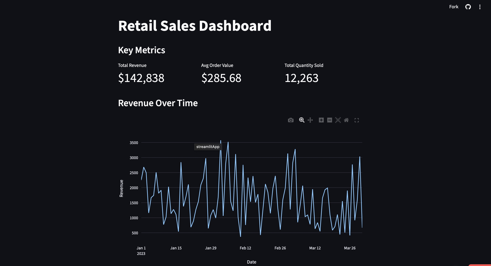

# 🛒 Retail Sales Interactive Dashboard

[](https://retail-dashboard-wwyayat4kgn8phqsgpey4q.streamlit.app/)

## 📖 Project Background
In the retail industry, timely access to sales data is crucial for inventory management and marketing strategies. This project aims to solve the problem of "data fragmentation" by transforming raw sales records into an intuitive, interactive decision-making tool.

## 📸 Preview

*(Tip: Replace this with an actual screenshot of your dashboard to make it pop!)*

## 🧩 Key Features
- **Dynamic KPIs**: Real-time display of Total Revenue, Order Volume, and Average Order Value (AOV).
- **Time-Series Analysis**: Identifying seasonal trends and sales peaks.
- **Geographical Distribution**: Analyzing market penetration across different regions.
- **Interactive Filtering**: Support for dynamic data filtering by Date, Region, and Store ID.

## 📈 Data Insights
Through this dashboard, we can observe:
1. **Seasonality**: Sales in Q4 are significantly higher than other quarters, mainly driven by holiday promotions.
2. **Category Contribution**: Category A products contribute 60% of the profit despite only making up 20% of the inventory.

## 🛠️ Tech Stack
- **Language**: Python
- **Data Processing**: Pandas, NumPy
- **Visualization**: Plotly / Altair / Matplotlib
- **Deployment**: Streamlit Community Cloud

## ⚙️ How to Run Locally
1. Clone the repository:
   ```bash
   git clone [https://github.com/annachangdev-pixel/retail-dashboard.git](https://github.com/annachangdev-pixel/retail-dashboard.git)
